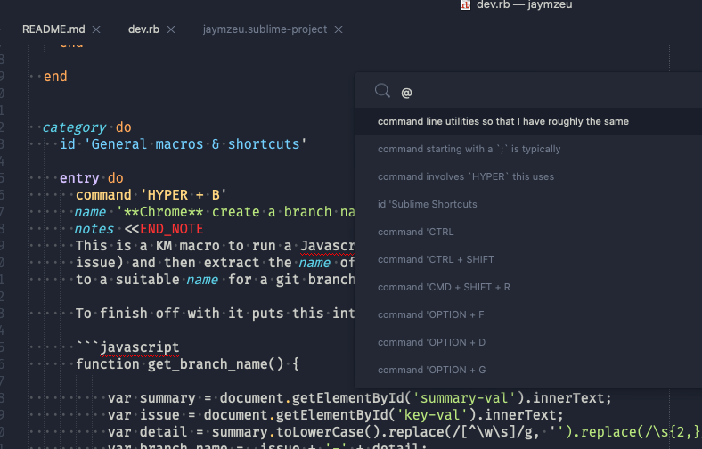

# My Development Cheat Sheet

This is another sheet for Dash (or Zeal) summarizing my typical development
work and setups. I tend to remap keybindings and heavily customize things
and then can sometimes forget over time.

This is to list out centrally tooling and commands I have used as a reminder
and learning resource.

For how and what I use on my Mac for work in general and the sort of UI
customizations I make to the environment have a look at 
[OSX Setup](osx_setup.md).

A simple syntax coloring file for Sublime for cheatsets:

